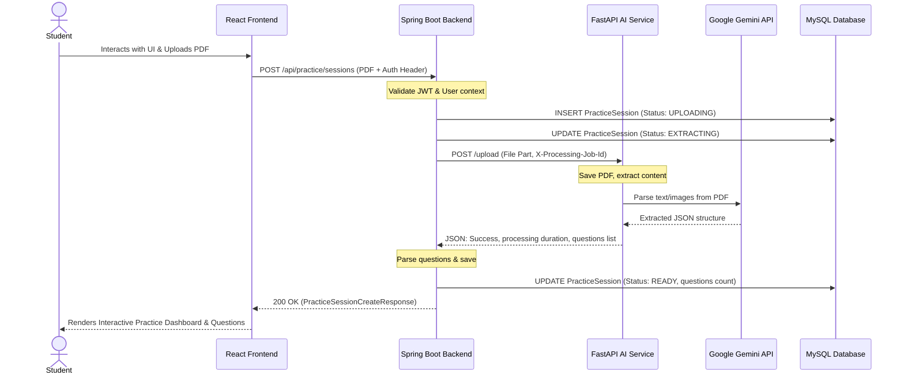

# ExamPilot 🚀

[](https://spring.io/projects/spring-boot)
[](https://fastapi.tiangolo.com/)
[](https://www.oracle.com/java/)
[](https://www.python.org/)
[](https://deepmind.google/technologies/gemini/)
[](https://www.mysql.com/)
[](https://jwt.io/)
[](https://opensource.org/licenses/MIT)

An AI-powered competitive exam practice test platform. ExamPilot enables students to upload standard competitive exam PDFs, automatically parses the question-answer structure using Google's state-of-the-art Gemini LLM, and transforms them into interactive online mock test sessions.

---

## 🌌 Project Vision
The vision of ExamPilot is to bridge the gap between static PDF question banks (like past JEE, NEET, or SAT papers) and interactive, metrics-driven learning. By automating structural extraction via LLMs, the platform immediately generates high-fidelity, interactive practice screens, tracks detailed user sessions, and lays the groundwork for adaptive AI tutoring.

---

## 🛠️ Key Features

### ✅ Current Features (Implemented)
- **Interactive React Frontend**: Modern single-page web client for practicing tests, monitoring state machine processing, and uploading practice PDFs.
- **Responsive Dark/Light/System Themes**: Dynamic theme modes persisted locally and applied across all views.
- **Multipart Document Intake**: Handles multipart uploads of exam PDFs with custom titles and practice configurations.
- **State-Machine Lifecycle Tracking**: Practice sessions undergo atomic state progressions: `UPLOADING` ➔ `EXTRACTING` ➔ `READY` (or `FAILED` upon errors).
- **Synchronous Microservice Client**: Spring Boot bridges to the FastAPI microservice via a synchronous HTTP `RestClient` configured with strict timeouts.
- **LLM Question Extraction**: FastAPI uses Google Gemini 2.5 Flash to structurally dissect PDF pages into clean JSON question blocks (questions, option arrays, correct answers, and explanations).
- **Visual Diagram Extraction**: Crops and saves inline charts, diagrams, and figures from exam PDFs using PyMuPDF and Google Gemini, served via Spring Boot routing (`/uploads/diagrams/**`).
- **Asynchronous Asset Sync & Cleanup**: Deep backend housekeeping via startup orphaned-asset sync and delete-session cleanup routines.
- **Account & Preference Management**: Settings dashboard to update profile configurations, change password, and delete accounts (purging all associated resources).
- **Unified Security Filter**: Validates stateless requests via a custom JWT-based authentication filter.
- **Mock Test Simulation Engine**: Real-time timer-based interface for taking simulated exams, saving progress, and managing attempts lifecycle (`NOT_STARTED` ➔ `ACTIVE` ➔ `COMPLETED`).
- **Interactive Review & Grading**: side-by-side performance review showing scores, correct/incorrect badges, time taken, and step-by-step LaTeX math notation answers.
- **Subject-wise Analytics**: Dynamic analytics tracker calculating overall test accuracy, streak timelines, and subject-level mastery without hardcoded exam parameters.
- **AI Guidance Mentor**: Contextual chatbot that analyzes student learning metrics and detailed subject accuracy to deliver structured study planning.

### 🔮 Future Roadmap
- **Adaptive AI Prep**: Recommends personalized mini-tests based on diagnosed weaknesses.

---

## 💻 Technology Stack

### Frontend (User Interface)
- **Language**: JavaScript (ES6+)
- **Framework**: React 19 + Vite 8
- **Styling**: Tailwind CSS v4
- **Routing**: React Router v7
- **HTTP Client**: Axios
- **Icons**: Lucide React
- **Notifications**: React Hot Toast

### Backend (Core Logic & Security)
- **Language**: Java 17
- **Framework**: Spring Boot 3.2.5 (Starter Web, Starter Security, Starter Data JPA)
- **Database Access**: Hibernate ORM
- **HTTP Client**: `RestClient` with customized `SimpleClientHttpRequestFactory` for timeout controls
- **Build Tool**: Maven

### AI Service (PDF & LLM Processing)
- **Language**: Python 3.10+
- **Framework**: FastAPI (ASGI server)
- **AI Integration**: Google GenAI SDK (Gemini 2.5 Flash model)
- **Validation**: Pydantic v2 schemas
- **PDF Handling**: PyMuPDF / PDF processing utilities

### Database
- **Engine**: MySQL 8.0 (Schema `MOCK_TESTER`)

### Authentication
- **Mechanism**: JSON Web Token (JWT) stateless authorization header / local storage storage

---

## 🏗️ Architecture Overview



For a detailed review of the microservices design, check out [MICROSERVICE_ARCHITECTURE.md](file:///e:/ExamPilot/docs/MICROSERVICE_ARCHITECTURE.md).

---

## 📂 Repository Structure
```text
ExamPilot/
│
├── FRONTEND/            # React + Vite Production Frontend Client
├── BACKEND/             # Spring Boot Production Backend (REST API, JWT, DB layer)
├── AI SERVICE/          # FastAPI Production AI Microservice (Gemini wrapper)
├── research/            # Research prototypes & historical experiments
│   └── pdf-extraction/  # Prototype OCR scripts & past PDF text extraction codes
├── docs/                # Architectural & project documentation files
│   ├── ROADMAP.md
│   ├── TECH_STACK.md
│   ├── MICROSERVICE_ARCHITECTURE.md
│   ├── API_OVERVIEW.md
│   ├── FUTURE_FEATURES.md
│   └── PROJECT_TIMELINE.md
└── PROJECT_STRUCTURE.md # Repository organization blueprint
```

---

## 🚀 Installation & Running Guide

### 📋 Prerequisites
- **Node.js**: Node 18+ and npm installed (for React Frontend).
- **Java**: JDK 17 installed and mapped to `JAVA_HOME`.
- **Python**: Python 3.10+ installed with `pip`.
- **Database**: Running MySQL 8.0 instance with a database named `MOCK_TESTER`.
- **API Keys**: Active Google Gemini API Key.

---

### How to Run React Frontend

1. Navigate to the `FRONTEND` directory:
   ```bash
   cd FRONTEND
   ```
2. Install dependencies:
   ```bash
   npm install
   ```
3. Start the Vite development server:
   ```bash
   npm run dev
   ```
   *The frontend client will run on port `5173` (e.g., http://localhost:5173).*

---

### How to Run Spring Boot Backend

1. Navigate to the `BACKEND` directory:
   ```bash
   cd BACKEND
   ```
2. Configure your local `application.properties`:
   Ensure your database connection details are updated in `src/main/resources/application.properties`.
3. Start the application:
   ```bash
   ./mvnw spring-boot:run
   ```
   *The backend will boot up on port `4040`.*

---

### How to Run FastAPI AI Service

1. Navigate to the `AI SERVICE` directory:
   ```bash
   cd "AI SERVICE"
   ```
2. Create and activate a Python virtual environment:
   ```bash
   python -m venv venv
   # On Windows:
   .\venv\Scripts\Activate.ps1
   # On macOS/Linux:
   source venv/bin/activate
   ```
3. Install dependencies:
   ```bash
   pip install -r requirements.txt
   ```
4. Create a `.env` file in the `AI SERVICE` directory:
   ```env
   GEMINI_API_KEY=your_gemini_api_key_here
   PORT=8000
   ```
5. Launch the FastAPI server:
   ```bash
   uvicorn app.main:app --reload --port 8000
   ```
   *The service will start on port `8000`.*

---

## 🔑 Environment Variables

| Variable Name | Location | Description |
| :--- | :--- | :--- |
| `GEMINI_API_KEY` | `AI SERVICE/.env` | Access credential key for Google Gemini model |
| `PORT` | `AI SERVICE/.env` | Network port for the FastAPI web server |

---

## 🔗 API Overview

| Service | Method | Endpoint | Description | Auth Required |
| :--- | :--- | :--- | :--- | :--- |
| **Spring Boot** | `POST` | `/api/auth/register` | Register a new user | No |
| **Spring Boot** | `POST` | `/api/auth/login` | Login and obtain JWT token | No |
| **Spring Boot** | `POST` | `/api/practice/sessions` | Create practice session & upload PDF | Yes (Bearer JWT) |
| **Spring Boot** | `GET` | `/api/practice/sessions` | List user's practice sessions (paginated) | Yes (Bearer JWT) |
| **Spring Boot** | `GET` | `/api/practice/sessions/{id}` | Get specific practice session details | Yes (Bearer JWT) |
| **Spring Boot** | `GET` | `/api/practice/sessions/{id}/questions` | Get questions for a session | Yes (Bearer JWT) |
| **Spring Boot** | `GET` | `/api/practice/sessions/{id}/summary` | Get session extraction summary | Yes (Bearer JWT) |
| **Spring Boot** | `POST` | `/api/practice/{sessionId}/test/start` | Start or resume a mock test attempt | Yes (Bearer JWT) |
| **Spring Boot** | `POST` | `/api/practice/test-sessions/{testSessionId}/submit` | Submit mock test responses for grading | Yes (Bearer JWT) |
| **Spring Boot** | `POST` | `/api/practice/{sessionId}/test/retake` | Create a new mock test attempt | Yes (Bearer JWT) |
| **Spring Boot** | `GET` | `/api/practice/test-sessions/{testSessionId}/review` | Fetch questions and graded answers for review | Yes (Bearer JWT) |
| **Spring Boot** | `GET` | `/api/dashboard/stats` | Retrieve generalized study statistics | Yes (Bearer JWT) |
| **Spring Boot** | `POST` | `/api/mentor/chat` | Chat with the dynamic AI Guidance Mentor | Yes (Bearer JWT) |
| **Spring Boot** | `GET` | `/api/users/profile` | Retrieve user profile settings and preferences | Yes (Bearer JWT) |
| **Spring Boot** | `PUT` | `/api/users/profile` | Update profile settings and theme preference | Yes (Bearer JWT) |
| **Spring Boot** | `GET` | `/api/users/profile/stats` | Retrieve comprehensive user stats | Yes (Bearer JWT) |
| **Spring Boot** | `PUT` | `/api/users/password` | Update current user account password | Yes (Bearer JWT) |
| **Spring Boot** | `POST` | `/api/users/me/delete` | Delete account and all user data/attempts | Yes (Bearer JWT) |
| **FastAPI** | `GET` | `/health` | Check microservice health status | No |
| **FastAPI** | `POST` | `/upload` | Extract questions directly from PDF | No (Internal) |
| **FastAPI** | `POST` | `/answer-key` | Extract answer mappings from an answer key PDF | No (Internal) |
| **FastAPI** | `DELETE` | `/cleanup` | Clean up deleted session PDF, crops, and output files | No (Internal) |
| **FastAPI** | `POST` | `/cleanup/sync-active` | Clean up orphaned files not referenced by active sessions | No (Internal) |

For complete payloads, request headers, and responses, view [API_OVERVIEW.md](file:///e:/ExamPilot/docs/API_OVERVIEW.md).

---

## 🔮 Future Roadmap
Check out our extensive [ROADMAP.md](file:///e:/ExamPilot/docs/ROADMAP.md) detailing past achievements and plans for future sprints.

---

## 🤝 Contribution Guidelines
1. Do not modify production configurations or API schemas without consulting the design documents under `docs/`.
2. Ensure that any backend REST changes match the structure mappings inside [PROJECT_STRUCTURE.md](file:///e:/ExamPilot/PROJECT_STRUCTURE.md).
3. Test locally using Postman with valid JWTs before pushing.

---

## 📄 License
This project is licensed under the MIT License - see the LICENSE file for details.

---

## 📧 Contact
For questions or feedback, please contact the repository maintainers.
