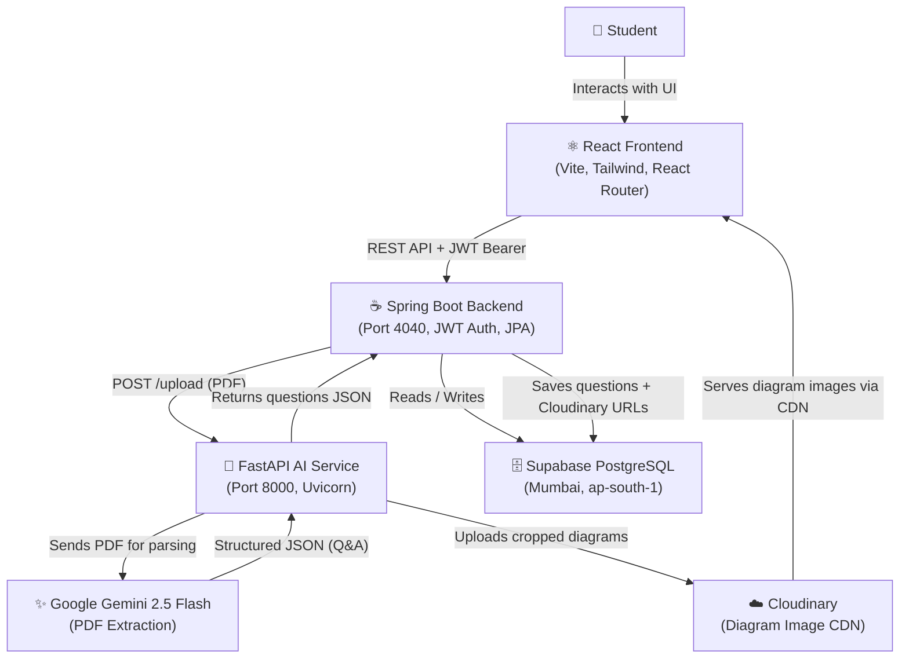
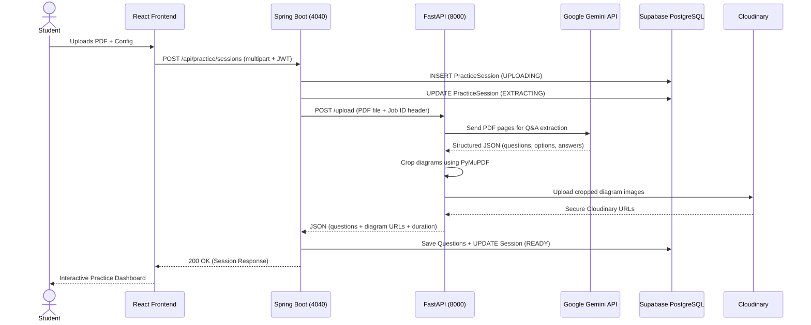

# ExamPilot 🚀

[](https://spring.io/projects/spring-boot)
[](https://fastapi.tiangolo.com/)
[](https://www.oracle.com/java/)
[](https://www.python.org/)
[](https://react.dev/)
[](https://deepmind.google/technologies/gemini/)
[](https://supabase.com/)
[](https://cloudinary.com/)
[](https://jwt.io/)
[](https://opensource.org/licenses/MIT)

An AI-powered competitive exam practice platform. ExamPilot lets students upload standard exam PDFs (JEE, NEET, KCET, etc.), automatically extracts questions and diagrams using Google Gemini 2.5 Flash, and transforms them into interactive timed mock test sessions with full analytics and review.

---

## 🌌 Project Vision

ExamPilot bridges the gap between static PDF question banks and interactive, metrics-driven learning. By automating structural extraction via LLMs, the platform instantly generates high-fidelity practice screens, tracks detailed session data, and lays the foundation for adaptive AI tutoring.

---

## 🛠️ Key Features

- **AI-Powered PDF Extraction** — Upload any competitive exam PDF; Gemini 2.5 Flash parses questions, options, answers, and explanations automatically.
- **Visual Diagram Extraction** — Inline diagrams and figures are cropped from PDFs using PyMuPDF and uploaded to Cloudinary for persistent cloud storage.
- **Interactive Mock Test Engine** — Real-time timer-based exam interface with flag/skip/navigate controls and lifecycle tracking (`NOT_STARTED → ACTIVE → COMPLETED`).
- **Full Review & Grading** — Side-by-side review showing score, correct/incorrect badges, time taken, and LaTeX math notation answers.
- **Subject-wise Analytics** — Dynamic dashboard tracking accuracy, attempt streaks, and subject mastery.
- **AI Guidance Mentor** — Contextual chatbot that analyzes your performance metrics and delivers structured study plans.
- **State Machine Session Tracking** — Sessions move atomically through `UPLOADING → EXTRACTING → READY` (or `FAILED`).
- **JWT Authentication** — Stateless security with full account management (profile, password change, account deletion).
- **User Preferences** — Persistent theme (Dark/Light/System) and study goal settings.
- **Supabase PostgreSQL** — Cloud-hosted database (Mumbai region) with Flyway schema migrations.

---

## 💻 Technology Stack

### Frontend
| Technology | Version | Purpose |
|---|---|---|
| React | 19 | UI Framework |
| Vite | 8 | Build Tool & Dev Server |
| Tailwind CSS | v4 | Utility-first Styling |
| React Router | v7 | Client-side Routing |
| Axios | latest | HTTP Client |
| Lucide React | latest | Icon Library |
| React Hot Toast | latest | Notifications |

### Backend
| Technology | Version | Purpose |
|---|---|---|
| Java | 17 | Language |
| Spring Boot | 3.2.5 | Core Framework |
| Spring Security | 6.x | JWT-based Auth |
| Hibernate / JPA | 6.x | ORM & Data Access |
| Flyway | latest | DB Schema Migrations |
| Maven | 3.x | Build Tool |
| PostgreSQL Driver | latest | DB Connector |

### AI Service
| Technology | Version | Purpose |
|---|---|---|
| Python | 3.10+ | Language |
| FastAPI | ≥0.100 | ASGI Web Framework |
| Uvicorn | ≥0.22 | ASGI Server |
| Google GenAI SDK | latest | Gemini 2.5 Flash Integration |
| PyMuPDF | ≥1.22 | PDF Rendering & Diagram Cropping |
| Cloudinary SDK | ≥1.34 | Cloud Image Upload |
| Pydantic v2 | ≥2.0 | Settings & Validation |
| Pillow | ≥10.0 | Image Processing |

### Cloud Infrastructure
| Service | Provider | Purpose |
|---|---|---|
| Database | Supabase (PostgreSQL, Mumbai) | Persistent Data Storage |
| Diagram Images | Cloudinary | Cloud Image CDN |

---

## 🏗️ Architecture Overview



### Request Flow: PDF Upload


---

## 📂 Repository Structure

```text
ExamPilot/
│
├── FRONTEND/                        # React + Vite SPA
│   ├── src/
│   │   ├── components/              # Reusable UI components
│   │   │   ├── landing/             # Landing page sections
│   │   │   ├── layout/              # Header, Footer, Sidebar
│   │   │   └── ui/                  # Generic UI primitives
│   │   ├── pages/                   # Route-level page components
│   │   ├── context/                 # React Context providers (Auth, Theme)
│   │   ├── hooks/                   # Custom React hooks
│   │   ├── services/                # Axios API service modules
│   │   ├── utils/                   # Formatting helpers & utilities
│   │   └── config/                  # App-level constants & configs
│   ├── public/
│   └── package.json
│
├── BACKEND/                         # Spring Boot REST API
│   ├── src/main/java/com/AI_BASED/BACKEND/
│   │   ├── CONFIG/                  # CORS, Security, Bean configs
│   │   ├── CONTROLLER/              # REST endpoint controllers
│   │   ├── DTO/                     # Request / Response DTOs
│   │   ├── ENTITY/                  # JPA entities (DB models)
│   │   ├── EXCEPTION/               # Global exception handling
│   │   ├── INTEGRATION/             # FastAPI microservice client
│   │   ├── JWT/                     # JWT filter & utilities
│   │   ├── REPOSITORY/              # Spring Data JPA repositories
│   │   ├── SERVICE/                 # Business logic services
│   │   └── UTIL/                    # Shared utility classes
│   ├── src/main/resources/
│   │   ├── application.properties   # App configuration (env-driven)
│   │   └── db/migration/            # Flyway SQL migration scripts
│   ├── .env.example                 # Environment variable template
│   └── pom.xml
│
├── AI SERVICE/                      # FastAPI AI Microservice
│   ├── app/
│   │   ├── api/                     # FastAPI route handlers
│   │   ├── services/                # Extractor & Cloudinary uploader
│   │   ├── utils/                   # Config loader & helpers
│   │   └── core/                    # Exception types
│   ├── uploads/                     # Temp PDF storage (gitignored)
│   ├── output/                      # Temp JSON output (gitignored)
│   ├── archive/                     # Processed file archive (gitignored)
│   ├── .env.example                 # Environment variable template
│   └── requirements.txt
│
├── storage/
│   └── diagrams/                    # Local fallback diagram storage (gitignored)
│
├── docs/                            # Architecture & developer documentation
│   ├── MICROSERVICE_ARCHITECTURE.md
│   ├── API_OVERVIEW.md
│   ├── ROADMAP.md
│   ├── TECH_STACK.md
│   └── FUTURE_FEATURES.md
│
├── research/                        # Historical prototypes & experiments
│   └── pdf-extraction/
│
├── .gitignore
├── PROJECT_STRUCTURE.md
└── README.md
```

---

## 🚀 Local Setup Guide

### 📋 Prerequisites
| Requirement | Version |
|---|---|
| Node.js + npm | 18+ |
| Java JDK | 17 |
| Python | 3.10+ |
| Maven | 3.8+ |
| Supabase Account | — |
| Cloudinary Account | — |
| Google Gemini API Key | — |

---

### 1️⃣ React Frontend

```bash
cd FRONTEND
npm install
npm run dev
```
> Runs on **http://localhost:5173**

---

### 2️⃣ Spring Boot Backend

1. Copy the environment template and fill in your credentials:
   ```bash
   cp BACKEND/.env.example BACKEND/.env
   ```
2. Edit `BACKEND/.env`:
   ```env
   SPRING_DATASOURCE_URL=jdbc:postgresql://your-supabase-host:5432/postgres
   SPRING_DATASOURCE_USERNAME=postgres.your_project_ref
   SPRING_DATASOURCE_PASSWORD=your_password
   ```
3. Run the backend:
   ```bash
   cd BACKEND
   ./mvnw spring-boot:run
   ```
> Runs on **http://localhost:4040**

---

### 3️⃣ FastAPI AI Service

1. Copy the environment template and fill in your credentials:
   ```bash
   cp "AI SERVICE/.env.example" "AI SERVICE/.env"
   ```
2. Edit `AI SERVICE/.env`:
   ```env
   GEMINI_API_KEY=your_gemini_api_key
   CLOUDINARY_CLOUD_NAME=your_cloud_name
   CLOUDINARY_API_KEY=your_api_key
   CLOUDINARY_API_SECRET=your_api_secret
   ```
3. Create the virtual environment and install dependencies:
   ```bash
   cd "AI SERVICE"
   python -m venv venv

   # Windows
   venv\Scripts\activate
   # macOS / Linux
   source venv/bin/activate

   pip install -r requirements.txt
   ```
4. Start the server:
   ```bash
   python -m uvicorn app.main:app --reload
   ```
> Runs on **http://localhost:8000**

---

## 🔑 Environment Variables Reference

### AI Service (`AI SERVICE/.env`)
| Variable | Required | Description |
|---|---|---|
| `GEMINI_API_KEY` | ✅ | Google Gemini API access key |
| `CLOUDINARY_CLOUD_NAME` | ✅ | Your Cloudinary cloud name |
| `CLOUDINARY_API_KEY` | ✅ | Cloudinary API key |
| `CLOUDINARY_API_SECRET` | ✅ | Cloudinary API secret |
| `HOST` | ❌ | Server host (default: `127.0.0.1`) |
| `PORT` | ❌ | Server port (default: `8000`) |
| `ENV` | ❌ | Environment name (default: `development`) |

### Backend (`BACKEND/.env`)
| Variable | Required | Description |
|---|---|---|
| `SPRING_DATASOURCE_URL` | ✅ | PostgreSQL JDBC connection URL |
| `SPRING_DATASOURCE_USERNAME` | ✅ | Database username |
| `SPRING_DATASOURCE_PASSWORD` | ✅ | Database password |

---

## 🔗 API Reference

### Spring Boot Backend (Port 4040)

| Method | Endpoint | Description | Auth |
|---|---|---|---|
| `POST` | `/api/auth/register` | Register new user | No |
| `POST` | `/api/auth/login` | Login & get JWT token | No |
| `POST` | `/api/practice/sessions` | Create session & upload PDF | JWT |
| `GET` | `/api/practice/sessions` | List user's sessions (paginated) | JWT |
| `GET` | `/api/practice/sessions/{id}` | Get session details | JWT |
| `GET` | `/api/practice/sessions/{id}/questions` | Get session questions | JWT |
| `GET` | `/api/practice/sessions/{id}/summary` | Get extraction summary | JWT |
| `POST` | `/api/practice/{sessionId}/test/start` | Start or resume mock test | JWT |
| `POST` | `/api/practice/test-sessions/{id}/submit` | Submit answers for grading | JWT |
| `POST` | `/api/practice/{sessionId}/test/retake` | Create new test attempt | JWT |
| `GET` | `/api/practice/test-sessions/{id}/review` | Get graded review | JWT |
| `GET` | `/api/dashboard/stats` | Retrieve study statistics | JWT |
| `POST` | `/api/mentor/chat` | Chat with AI mentor | JWT |
| `GET` | `/api/users/profile` | Get user profile & preferences | JWT |
| `PUT` | `/api/users/profile` | Update profile & theme | JWT |
| `GET` | `/api/users/profile/stats` | Get comprehensive user stats | JWT |
| `PUT` | `/api/users/password` | Change account password | JWT |
| `POST` | `/api/users/me/delete` | Delete account & all data | JWT |

### FastAPI AI Service (Port 8000)

| Method | Endpoint | Description |
|---|---|---|
| `GET` | `/health` | Service health check |
| `POST` | `/upload` | Extract questions from PDF (internal) |
| `POST` | `/answer-key` | Extract answer key from PDF (internal) |
| `DELETE` | `/cleanup` | Remove session files from disk (internal) |
| `POST` | `/cleanup/sync-active` | Remove orphaned files (internal) |

---

## 🔮 Future Roadmap
- **Adaptive AI Prep** — Personalized mini-tests based on diagnosed weaknesses
- **Multi-subject Support** — Cross-subject performance correlation
- **Mobile App** — React Native companion app
- **Collaborative Study** — Group practice sessions

See [ROADMAP.md](docs/ROADMAP.md) for full details.

---

## 🤝 Contribution Guidelines

1. Never commit `.env` files — use `.env.example` as a template.
2. Do not modify production configurations without consulting `docs/`.
3. Test all backend changes locally with Postman before pushing.
4. Run `npm run dev` and verify UI changes before opening a PR.

---

## 📄 License

This project is licensed under the MIT License.

---

## 📧 Contact

For questions or feedback, please open an issue on GitHub.
