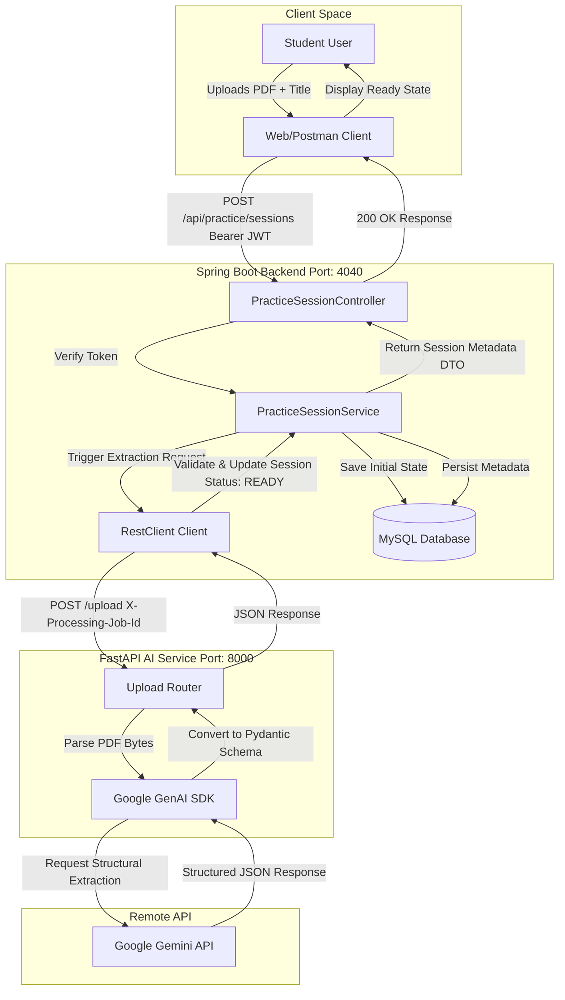

# Microservice Architecture 🏗️

This document describes the architectural flow, component relationships, and microservice boundaries within the ExamPilot system.

---

## 🗺️ Architectural Flow

The following diagram illustrates the complete end-to-end data pipeline when a student uploads a competitive exam PDF.



---

## 🔄 End-to-End Sequence Diagram

This sequence diagram depicts the chronological message exchange between systems, highlighting how transaction isolation and timeouts are managed.

```mermaid
sequenceDiagram
    autonumber
    actor Student as Student Client
    participant SB as Spring Boot Backend (Port 4040)
    database MySQL as MySQL DB
    participant FA as FastAPI AI Service (Port 8000)
    participant Gemini as Google Gemini API (Remote)

    Student->>SB: POST /api/practice/sessions (Multipart PDF, Bearer Token)
    activate SB
    Note over SB: JwtAuthenticationFilter validates Bearer token
    SB->>MySQL: Insert PracticeSession (Status: UPLOADING)
    SB->>MySQL: Update PracticeSession (Status: EXTRACTING)
    
    SB->>FA: POST /upload (File bytes, X-Processing-Job-Id header)
    activate FA
    Note over FA: Save PDF, start extraction timer
    FA->>Gemini: Send prompt + PDF content (Request structured JSON)
    activate Gemini
    Note over Gemini: Parse pages, locate questions, formats choices
    Gemini-->>FA: Raw JSON data (questions, option arrays, correct answers)
    deactivate Gemini
    
    Note over FA: Validate response using Pydantic QuestionResponse schema
    FA-->>SB: 200 OK (ExtractionResponse JSON)
    deactivate FA
    
    Note over SB: Map questions count & update duration
    SB->>MySQL: Update PracticeSession (Status: READY, questionsCount=N)
    SB-->>Student: 200 OK (PracticeSessionCreateResponse DTO)
    deactivate SB

    Note over SB, FA: Exception Fallback Scenario
    Note over SB: If FastAPI returns 4xx/5xx or times out:
    SB->>MySQL: Update PracticeSession (Status: FAILED)
    SB-->>Student: 500 Internal Server Error (ExtractionErrorResponseDto)
```

---

## 🏢 Service Responsibilities

### 1. Spring Boot Backend (Port `4040`)
- **JWT Gatekeeper**: Evaluates incoming headers on secure endpoints, blocking unauthorized requests.
- **State Machine Controller**: Manages database records and guarantees transaction integrity. State changes (`UPLOADING` ➔ `EXTRACTING` ➔ `READY`/`FAILED`) are written to the database atomically.
- **Client Integration**: Employs `RestClient` configured with a connection timeout of **10 seconds** and a read timeout of **180 seconds** (giving the Gemini API ample time to scan large documents).
- **Graceful Error Handler**: Uses `@RestControllerAdvice` to trap `ExtractionException` and format it into a developer-friendly JSON output payload.

### 2. FastAPI AI Service (Port `8000`)
- **PDF File Processing**: Validates file types (`application/pdf`) and writes file streams to secure uploads storage.
- **Gemini Orchestration**: Constructs instructions and prompt configurations to guide the Gemini model.
- **Validation Engine**: Maps extraction output to strict Pydantic structures (`QuestionResponse` and `ExtractionResponse`) before responding to the caller.
- **Diagnostics Logger**: Inspects and logs `X-Processing-Job-Id` header values to simplify debugging across container boundaries.
